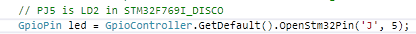

# GpiController extension for STM32 targets

This adds the extension `OpenStm32Pin(portName, pin)` to `GpioController` allowing the developer to conveniently use the standard STM naming for GPIO ports.

Like this:

## How to use?

Add this NuGet package to your project: `nanoFramework.Extensions.Stm32.GpioController`.

Contributor: @josesimoes
